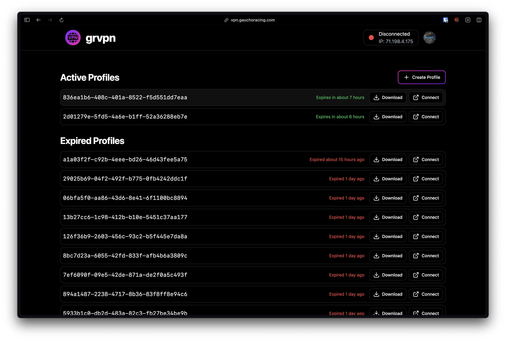
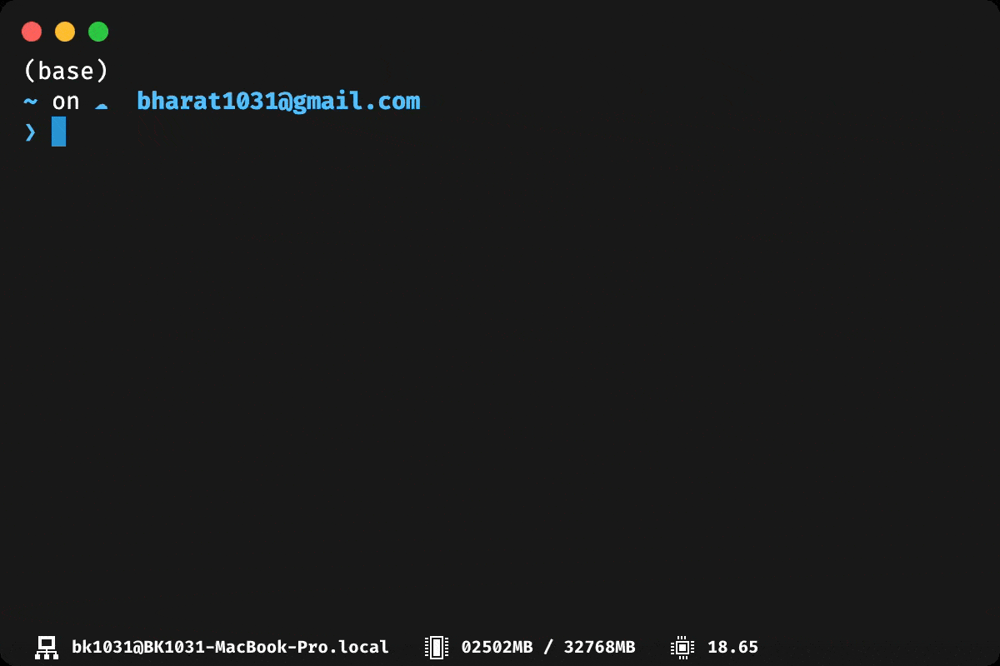

# grvpn

[](https://github.com/Gaucho-Racing/grvpn/actions/workflows/build.yaml)
[](https://app.netlify.com/projects/gr-vpn/deploys)
[](https://github.com/gaucho-racing/grvpn/releases)
[](https://pypi.org/project/grvpn/)
[](https://opensource.org/licenses/MIT)

<div style="display: flex; gap: 10px; justify-content: center; align-items: center;">
  
  
</div>

grvpn is Gaucho Racing's custom VPN manager and client. It is designed to allow users to connect to Gaucho Racing's internal network and easily access AWS resources. Built on top of [OpenVPN](https://openvpn.net/), it provides a simple and easy to use interface for managing VPN connections.

Check out our wiki page [here](https://wiki.gauchoracing.com/books/grvpn) to learn more.

## Getting Started

### Prerequisites:

- [Go](https://go.dev/doc/devel/release#go1.23.0) 1.23+
- [OpenVPN](https://formulae.brew.sh/formula/openvpn) 2.6+
  - Note: `openvpn` is not available on Windows.
- [Node.js](https://nodejs.org/en/download/) 22+
- [npm](https://docs.npmjs.com/downloading-and-installing-node-js-and-npm) 10+
- [Python](https://www.python.org/downloads/) 3.12+
- [Poetry](https://python-poetry.org/)

### 1. Setup local database

Start by running a local PostgreSQL database. The provided `docker-compose.yaml` let's you easily spin up a local instance.

```
docker compose up -d
```

You should now have a database called `grvpn` running on `localhost:5432`.

### 2. Configure environment variables

Create a `server/.env` file and copy in the following environment variables.

```
ENV=DEV
PORT=9999

DATABASE_HOST=localhost
DATABASE_PORT=5432
DATABASE_USER=postgres
DATABASE_PASSWORD=password
DATABASE_NAME=grvpn

SENTINEL_URL=https://sentinel-api.gauchoracing.com
SENTINEL_JWKS_URL=https://sso.gauchoracing.com/.well-known/jwks.json
SENTINEL_CLIENT_ID=
SENTINEL_CLIENT_SECRET=
SENTINEL_TOKEN=
SENTINEL_REDIRECT_URI=http://localhost:5173/auth/login
```

Make sure to set the client id and secret for your application. If you don't have one already, you can create one through [Sentinel](https://sso.gauchoracing.com/applications).

### 3. Start the backend

Navigate to the `server/` directory and execute the following.

```
make run
```

This will automatically install dependencies, source the `.env` file, and start the application. The backend should now be listening on `localhost:9999` (or whatever you set `PORT` to).

### 4. Start the frontend

Navigate to the `web/` directory and execute the following.

```
npm install
npm run dev
```

Make sure to update the `SENTINEL_CLIENT_ID` and `BACKEND_URL` values in `src/consts/config.tsx`.

Open [http://localhost:5173](http://localhost:5173) in your browser to see the result.

### 5. Start the CLI

Navigate to the `cli/` directory and execute the following.

```
poetry install
poetry run grvpn --help
```

**Note:** The CLI does not support Windows.

## Contributing

If you have a suggestion that would make this better, please fork the repo and create a pull request. You can also simply open an issue with the tag "enhancement".
Don't forget to give the project a star! Thanks again!

1. Fork the Project
2. Create your Feature Branch (`git checkout -b gh-username/my-amazing-feature`)
3. Commit your Changes (`git commit -m 'Add my amazing feature'`)
4. Push to the Branch (`git push origin gh-username/my-amazing-feature`)
5. Open a Pull Request

## License

Distributed under the MIT License. See `LICENSE.txt` for more information.
